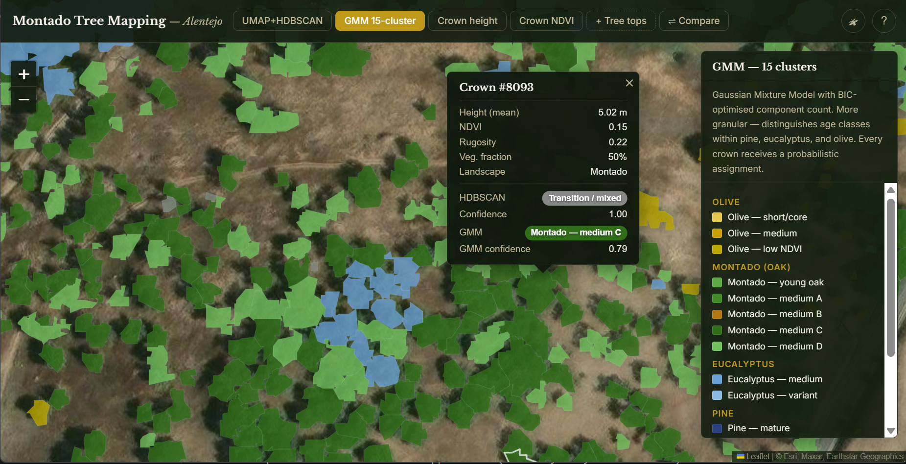

# Montado Tree Mapping - Automated Individual Tree Detection and Vegetation Classification from LiDAR

A end-to-end geospatial pipeline for automated detection, segmentation, and unsupervised classification of individual trees across a 4 km² montado landscape in central Portugal, using airborne LiDAR point cloud data and Sentinel-2 multispectral imagery.

**Study area:** Alentejo region, central Portugal, near the Spanish border  
**Data:** 4 × 1 km² LiDAR tiles (CC-BY-4.0 © DGT — Direção-Geral do Território), Sentinel-2 L2A  
**CRS:** EPSG:3763 (PT-TM06)  
**Tools:** Python, QGIS, GDAL, laspy, scikit-learn, UMAP, HDBSCAN

---

## 🗺 Explore the results interactively

**[→ Open the interactive map](https://veronikastengel.github.io/montado-tree-mapping/)**

Click individual tree crowns, toggle between classification methods, and drag the comparison divider to see how GMM and UMAP+HDBSCAN differ across the landscape.



The map shows:
- **~19,000 individual tree crown polygons** styled by vegetation cluster
- **Two unsupervised classification methods** to compare side by side
- **Crown-level LiDAR metrics** (height, NDVI, rugosity) on click
- **Tree top detection points** as an overlay
- Toggle between satellite and dark basemap

---

## Why this project

Cork oak (*Quercus suber*) and holm oak (*Quercus rotundifolia*) are legally protected species in Portugal. Landowners are required to know where they are. Traditional field-based tree inventories in open montado are expensive and time-consuming.

This is an **exploratory research project** with two goals: first, to investigate how far automated LiDAR-based methods can go in mapping individual trees without any field visits; second, to systematically compare multiple unsupervised classification approaches (K-Means, GMM, UMAP+HDBSCAN) and understand where each succeeds or breaks down on real ecological data.

---

## Results summary

- **~19,000 individual tree crowns** delineated across 4 km²
- **7 vegetation clusters** identified by UMAP + HDBSCAN: olive grove, montado oak woodland, shrubland, maritime pine, mature eucalyptus, harvested eucalyptus, transition zones
- **15 finer sub-clusters** identified by GMM, including age class distinctions within pine, eucalyptus, and olive
- Intra-montado species differentiation (cork oak vs holm oak) was not achievable with unsupervised methods alone — consistent with published literature showing these species require hyperspectral data or supervised classification with field-verified training samples

---

## Pipeline overview

```
01_prepare_data.py
02_treetop_detection_lidar.py
03_crown_segmentation.py
04a_extract_sentinel2.py
04b_landscape_classification.py
05a_feature_extraction.py
05b_feature_correlation.py
06a_kmeans_pca_classification.py
06b_gmm_classification.py
06c_umap_hdbscan_classification.py
```

---

## Feature set used for classification

Based on Spearman correlation analysis, the following 14 features were used:

| Feature | Description |
|---------|-------------|
| `mean_height` | Mean crown height above ground (m) |
| `height_width_ratio` | Crown height to width ratio |
| `mean_intensity` | Mean LiDAR return intensity |
| `mean_ndvi` | Mean NDVI from point-level NIR+Red |
| `rugosity` | Crown surface roughness |
| `vert_dist_top25` | Fraction of returns in top 25% of crown |
| `vert_dist_bot25` | Fraction of returns in bottom 25% of crown |
| `point_density` | LiDAR points per m² |
| `landscape_conf` | Sentinel-2 landscape classification confidence |
| `lc_olive` | One-hot: olive grove landscape |
| `lc_montado` | One-hot: montado landscape |
| `lc_eucalyptus` | One-hot: eucalyptus plantation |
| `lc_pine` | One-hot: maritime pine |
| `lc_shrubland` | One-hot: shrubland |

---

## Installation

```bash
# Install dependencies (using QGIS Python / OSGeo4W shell on Windows)
pip install laspy[lazrs] scikit-image scikit-learn umap-learn hdbscan shapely numpy scipy matplotlib seaborn
```

All scripts are designed to run from the project root directory using the Python environment bundled with QGIS (OSGeo4W shell on Windows), which provides GDAL, OGR, and related geospatial libraries.

---

## Data

Raw LiDAR data is not included in this repository due to file size. The data is freely available from the Portuguese national mapping authority:

- **DGT (Direção-Geral do Território):** [https://www.dgterritorio.gov.pt](https://www.dgterritorio.gov.pt)
- **License:** CC-BY-4.0 — [https://creativecommons.org/licenses/by/4.0/](https://creativecommons.org/licenses/by/4.0/)
- **Attribution:** © DGT — Direção-Geral do Território, Portugal

Sentinel-2 data available via:
- **Copernicus Data Space:** [https://dataspace.copernicus.eu](https://dataspace.copernicus.eu)

---

## Limitations and future work

- Cork oak vs holm oak differentiation was not achieved with unsupervised methods. Supervised classification with field-verified training samples (minimum ~30 per species) and potentially hyperspectral data would be required.
- The study area is limited to 4 km². The pipeline is designed to scale to larger areas with minimal modification.
- The Sentinel-2 scene used is a single date (September 2024). Multitemporal analysis incorporating phenological differences between seasons would likely improve species discrimination.
- Urban/settlement areas were excluded via a combined vegetation and civilisation mask. Some garden trees at the urban fringe may remain in the dataset.

---

## References

- Popescu, S.C. & Wynne, R.H. (2004). Seeing the trees in the forest: using lidar and multispectral data fusion with local filtering and variable window size for estimating tree height. *Photogrammetric Engineering & Remote Sensing*, 70(5), 589–604.
- McInnes, L., Healy, J. & Melville, J. (2018). UMAP: Uniform Manifold Approximation and Projection for Dimension Reduction. *arXiv:1802.03426*.
- Campello, R.J.G.B., Moulavi, D. & Sander, J. (2013). Density-Based Clustering Based on Hierarchical Density Estimates. *PAKDD 2013*, LNAI 7819, 160–172.

---

## Acknowledgements

Pipeline developed with assistance from Claude AI (Anthropic) for code generation and geospatial methodology discussion. All analytical decisions, parameter choices, ecological interpretation, and project direction by Veronika Stengel.